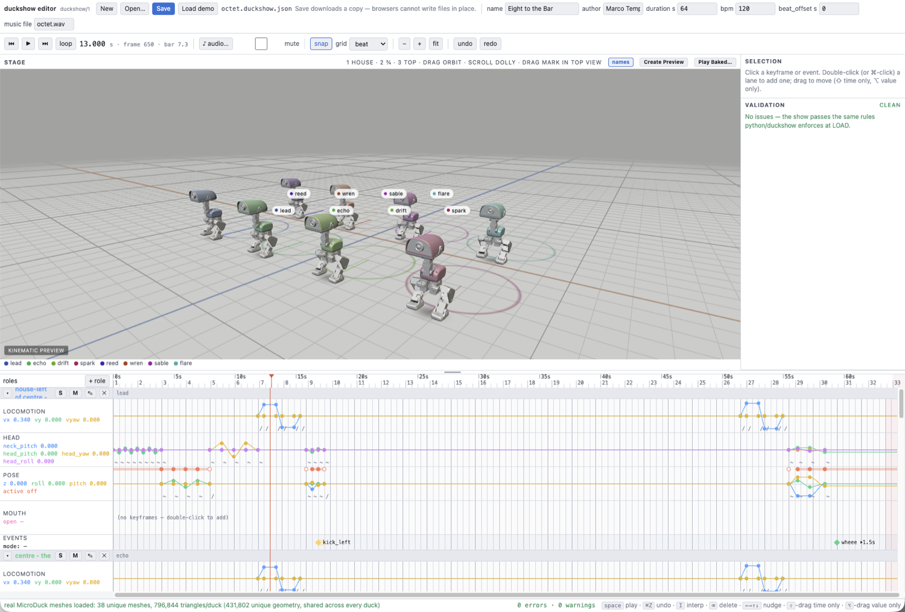
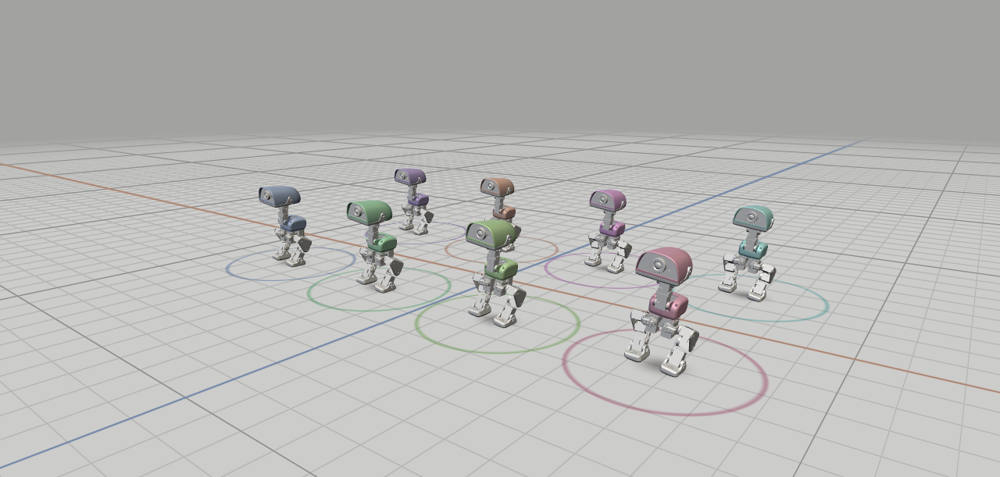
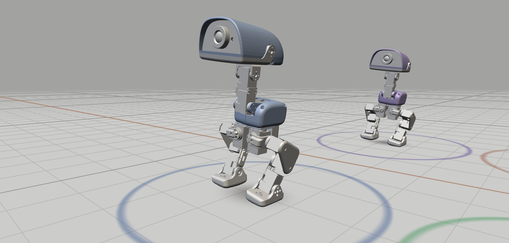
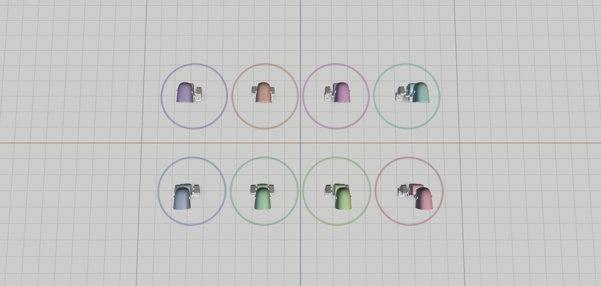

# MicroDuckSwarm

[](https://github.com/virtualmagician/MicroDuckSwarm/actions/workflows/ci.yml)
[](LICENSE)
[](python/)
[](SwarmLink/)

**A choreography system for a flock of [Pollen Robotics MicroDucks](https://pollen-robotics.com/microduck/).** Author a piece on a timeline, preview the whole cast in 3D, and play it back on stage in sync with music and video.



The hard part is timing, not networking. Each duck holds its own copy of the show and plays it locally; the network carries only a shared clock and start/stop triggers. That is the same approach drone light shows and Falcon Player use, and it is why a WiFi dropout mid-number costs nothing. Everything here runs against a mock duck, so the stack is testable before hardware arrives.

## Quick start

```bash
./scripts/edit.sh shows/octet
```

Serves the checkout, opens the editor with the eight-duck piece loaded, and stops again on Ctrl+C. Space plays. Keys `1` `2` `3` switch between the house, three-quarter and top cameras. Drag to orbit. No build step, no dependencies, no CDN.

To watch the entire stack run without a single robot (two mock ducks, a duck-agent on each, the show master driving them, and a verifier checking they stayed in sync):

```bash
./scripts/e2e_demo.sh
```

## The idea

A show is authored once, compiled to a `.duckshow` file, and **pre-loaded onto every duck**. On show night the network carries only a shared clock, start and stop triggers, and telemetry. Each duck performs its own part locally at 50 Hz against MicroDuck's `robotd` daemon, so a WiFi dropout mid-number costs nothing:

```
 .duckshow ──▶ SwarmLink master ──UDP──▶ duck-agent ──▶ robotd ──▶ ONNX policies ──▶ 15 servos
                (clock + triggers)        (50 Hz local playback)
```

**Pre-load the show, synchronise only clocks, never stream the performance.** Most of the design follows from that.

Choreography here is **intent curves, not joint keyframes**. `robotd` accepts only high-level intents (`robot.move`, `robot.head`, `robot.pose`, `robot.mouth`, plus one-shot skills and sounds) and the robot's reinforcement-learned policies handle balance underneath. A `.duckshow` is therefore a handful of low-dimensional timed tracks per cast role, snapped to a beat grid. That makes authoring look like a sequencer rather than a character-animation rig.

## What it looks like

The stage viewer is a **kinematic preview**. It shows staging, spacing and silhouette, not physics. These shots use Pollen's real meshes, which the viewer renders when you supply them; without them it draws our own primitive duck.



The floor is measured: 1 m major lines, 10 cm minor divisions, tinted axes through the origin. A MicroDuck is 25 cm tall, so it stands about two and a half minor squares high.





Top view is for formations and marks. Drag a duck's start ring and it persists into the show file. `shows/octet` is 64 seconds at 120 bpm for eight ducks: a unison opening, eight solo turns, and a unison finale.

## Prior art and influences

Where the design comes from:

- **Boston Dynamics' Spot Choreography SDK.** The [Choreographer](https://dev.bostondynamics.com/docs/concepts/choreography/choreographer.html) data model of beats, slices and per-actuator tracks, uploaded ahead of time and executed from a shared start timestamp, is the closest documented ancestor of the `.duckshow` format.
- **Disney Research's BDX droids.** *[Design and Control of a Bipedal Robotic Character](https://arxiv.org/abs/2501.05204)* establishes the pattern this project's authoring loop imitates: artist-authored motion becomes an imitation-learning reference, a command-conditioned policy executes it, and a human operator drives the result live. MicroDuck descends from the same lineage via [Open Duck Mini](https://github.com/apirrone/Open_Duck_Mini).
- **Drone light shows.** [Verge Aero on how a show actually runs](https://docs.verge.aero/drone-show-technology/how-drone-shows-work-an-overview) (upload the entire show to every aircraft, then trigger against a scheduled future timestamp), and [Verity Studios](https://www.veritystudios.com/technology) treating performing robots as ordinary timecode-cued show devices.
- **[Falcon Player](https://github.com/FalconChristmas/fpp) and xLights.** Prior art for many small WiFi nodes performing in sync to music: a master emitting lightweight sync packets while each node free-runs its own local copy.
- **[RFC 9119](https://www.rfc-editor.org/rfc/rfc9119.html), on multicast over IEEE 802.11.** Why must-arrive messages here are unicast, repeated and idempotent. 802.11 neither acknowledges nor retransmits multicast frames, so a "start" packet can silently reach seven ducks out of eight.
- **Audiovisual synchrony thresholds.** Misalignment below roughly 20 ms is imperceptible, and detection is asymmetric. That sets the sync budget the whole system is engineered against.
- **[QLab](https://qlab.app/docs/v5/networking/)** and the OSC show-control conventions it popularised, which the `swarmctl serve` facade mirrors so the flock behaves like any other cued device in an existing rig.

## Status

Pre-hardware. MicroDuck units ship late 2026. Everything here runs today against a protocol-faithful mock duck, with the wire protocol verified against the [microduck](https://github.com/pollen-robotics/microduck) source (`duck-ipc-proto`, API version 17).

| | |
|---|---|
| Cross-duck event sync (localhost, mock ducks) | **1.3 ms** measured, against a ~20 ms perceptual budget |
| Clock discipline | NTP-style over UDP, min-RTT filtered, slew-limited |
| Tests | 345 Python, 183 Swift, 268 editor |
| End-to-end gates | 3: Python master, Swift master over OSC, recorder round-trip |
| Physics bake | **6.0 s** for the eight-duck, 64 s show (25,600 frames, 4,281 frames/s) |
| Third-party runtime dependencies | **0** |

Python is standard-library only so the agent runs on a stock Armbian image. SwarmLink uses only system frameworks. The editor has no build step and no CDN, so it opens at a venue with no internet. The physics baker in `tools/bake/` is the one exception, and it is an optional developer tool: nothing in the repo imports it, no duck installs it, and everything works with it absent.

**Provisioning** (`deploy/`, `docs/provisioning.md`) is written but untested against hardware, which every script says in its own header.

## Roadmap

Not built yet, and what unblocks each item.

| Not built | Trigger |
|---|---|
| **Hardware bring-up:** latency and jitter measurement, `robot.setMode` timing, battery and boot timing, deadman behaviour under load | Hardware. |
| **Rust port of the agent tick loop** | Only if the RK3566 cannot hold 40 Hz in Python. The `robotd` deadman is 500 ms, so a stalled tick loop zeroes velocity. |
| **DuckSwarm.app:** SwiftUI shell around SwarmLink, editor in a WKWebView, recorder, preflight dashboard | Real telemetry. The dashboard shows battery, RSSI, clock offset and heartbeat age; the thresholds are unknown until measured. |
| **Servo cues:** laser homing, colour-beacon homing, marker following | Camera access for our agent alongside `mediad`, which owns it for WebRTC. Untested. |
| **Intended-versus-actual drift diff:** planned and simulated paths drawn together | Nothing. Both paths are on disk in comparable coordinates. |
| **`roulade` and roller mode** in the bake | `roulade` executes but ends inverted, and `manifest.json` marks it `chain: true` without naming what it chains into. Roller mode needs a second MJCF (`robot_groundcontact_rollers.xml`) and `roller.onnx` loaded alongside the legged model. The other three skills are driven. |
| **Overhead tag tracking** for tight walking formations | Only if in-place work and loose blocking prove insufficient in rehearsal. |
| **Markerless person following** on the onboard NPU (~0.8 TOPS) | After marker-based servo cues work. |
| **Blender import** for spatial authoring | Only if timeline authoring proves too slow for longer pieces. |

Most of this is gated on hardware. MicroDuck currently quotes a four-to-six month lead time.

## Repository layout

| Path | What it is |
|---|---|
| `docs/` | Specs, the contracts between components, written before the code |
| `docs/duckshow-format.md` | The `.duckshow` choreography file format |
| `docs/swarmlink-protocol.md` | Clock sync, triggers, telemetry and the puppet channel over UDP |
| `docs/robotd-api.md` | Verified MicroDuck `robotd` JSON-RPC surface (API v17) |
| `docs/osc-facade.md` | OSC 1.0 control surface for external rigs |
| `docs/authoring.md` | Puppeteering, `swarmctl record`, the timeline editor |
| `docs/viewer.md` | The 3D stage viewer and the baked-physics preview |
| `docs/bake-parts.md` | What the bake needs, where each part comes from, and its licence |
| `docs/bake-format.md` | The `duckbake/1` pose-cache format |
| `docs/provisioning.md` | Installing the agent on a duck, and pushing shows and policies |
| `python/duckshow/` | Format library: parse, validate, sample at 50 Hz |
| `python/duck_agent/` | On-duck agent: clock discipline, local playback, telemetry, puppet channel |
| `python/mock_duck/` | Protocol-faithful mock `robotd`, with a timestamped intent log |
| `python/tools/` | Reference show master, stdlib OSC send and listen, puppet streamer |
| `SwarmLink/` | Swift 6 package: master engine, `swarmctl` CLI, OSC facade, recorder |
| `editor/` | Zero-dependency timeline editor, WebGL2 stage viewer, bake playback |
| `tools/bake/` | Optional native physics baker (MuJoCo plus the shipped policies) |
| `deploy/` | Systemd unit and provisioning scripts, untested against hardware |
| `shows/` | Example choreographies, including the eight-duck `octet` |
| `scripts/` | Launcher and three end-to-end gates |

## Components

### Python, the duck side

Python 3.10+, standard library only, on the duck and off it.

```bash
cd python && python3 -m unittest discover -s tests
```

### SwarmLink, the show side

Swift 6, strict concurrency, zero third-party dependencies (Network.framework for UDP).

```bash
cd SwarmLink && swift build && swift test
```

`swarmctl` is the show-master CLI. For show night with any rig that speaks OSC, such as QLab, TouchDesigner or a lighting desk:

```bash
swarmctl serve --roster roster.json --shows-dir shows/    # OSC on UDP 53300, Bonjour _duckswarm._udp
python3 python/tools/osc_send.py 127.0.0.1:53300 /duckswarm/load s:octet
python3 python/tools/osc_send.py 127.0.0.1:53300 /duckswarm/go
```

Commands: `/duckswarm/{load,play,go,seek,stop,panic,ping,status}`, with status pushed to any address that pinged in the last five seconds. Full table in [`docs/osc-facade.md`](docs/osc-facade.md).

### Authoring

Three ways into a `.duckshow` file, detailed in [`docs/authoring.md`](docs/authoring.md):

- **Puppet with a gamepad.** `swarmctl record` streams a controller to one duck over the live puppet channel and captures the intent stream as that role's tracks, one role at a time, layering onto a show that plays back around you.
- **Scripted recordings.** `--input script:<file.json>` replays timed input frames instead of a live controller. Reproducible, which is how CI exercises the recorder.
- **The timeline editor.** Keyframes and events on a beat grid, with the 3D stage above showing the whole cast. Roles can be renamed from their lane header, and **S** and **M** solo and mute a duck for rehearsal: a soloed or muted duck holds its neutral pose and dims in the 3D view. Solo and mute are session state and never touch the show file.

The puppet channel doubles as a show-night nudge layer. Puppeteering a duck mid-playback *adds* to its locomotion and *overrides* its head and pose while packets stay fresh (250 ms deadman), then hands control back to the timeline. Panic and stop mute it outright.

### Create Preview: baked physics

The kinematic viewer shows staging. It does not tell you how the real policies behave under the choreography. `tools/bake/` does: it drives a MuJoCo simulation of each role against the shipped ONNX policies and writes a `duckbake/1` pose cache, which the editor replays through the same renderer. Physics is a render step, not a live mode, so scrubbing keeps working because you are scrubbing recorded data.

Press **Create Preview** in the editor. It bakes the show you have loaded, shows per-role progress, and drops you into BAKED PHYSICS playing the fresh cache. The eight-duck, 64 second octet takes about 6 seconds.

That works because `./scripts/edit.sh` serves the editor through `scripts/editor_server.py`, a stdlib-only local server bound to `127.0.0.1` that can run the baker on request. It validates that the requested show resolves inside the repo, passes a fixed argv rather than a shell, and lets a caller choose nothing except which show gets baked. Open the editor any other way and it stays a plain static page: the button disables itself and says why.

The terminal route still works, and is what scripting uses:

```bash
cd tools/bake
python3.12 -m venv .venv && .venv/bin/pip install -r requirements.txt   # once
.venv/bin/python3 bake_show.py ../../shows/octet/octet.duckshow.json /tmp/octet.duckbake.json
```

A cache whose show hash does not match is refused rather than replayed misleadingly, and a show with unsaved edits refuses to bake at all.

Read the bake log inside the cache. It records what was and was not driven: `kick_left`, `kick_right`, `ground_pick` and `sit_toggle` run their own policies, while `roulade` and roller mode are logged unsimulated rather than run through the wrong model. A bake is a check on the choreography, not a substitute for a rehearsal.

Requires `assets/microduck/`, which you supply yourself (see below). Format in [`docs/bake-format.md`](docs/bake-format.md), parts and setup in [`docs/bake-parts.md`](docs/bake-parts.md).

## Assets and licensing

This repository contains **no Pollen Robotics files**. MicroDuck's meshes, MJCF model and hardware design files are licensed CC BY-SA-NC and are not redistributed here.

The duck in the viewer is our own geometry, built from primitives, and it is what a fresh clone renders. If you supply Pollen's assets in a gitignored `assets/microduck/` (the way an emulator does not ship a BIOS, see [`docs/bake-parts.md`](docs/bake-parts.md) §2), the viewer uses the real robot meshes instead and the physics bake becomes available. Absent, both fall back silently and everything still works.

MIT, see [LICENSE](LICENSE). MicroDuck is a product of [Pollen Robotics](https://pollen-robotics.com/) and [Hugging Face](https://huggingface.co/pollen-robotics). This is an independent, unaffiliated project.
