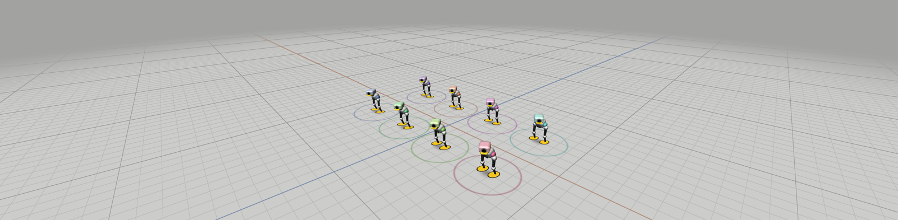

# MicroDuckSwarm

[](https://github.com/virtualmagician/MicroDuckSwarm/actions/workflows/ci.yml)

Choreography authoring and playback for a flock of [Pollen Robotics MicroDucks](https://pollen-robotics.com/microduck/) — synchronized to music and video, built for live keynote stages.



*The stage viewer — a kinematic preview of `shows/octet`, eight ducks on a 1 m grid with 10 cm divisions. Scrub the timeline and the flock performs.*

## Quick start

```bash
./scripts/edit.sh shows/octet
```

Serves the repo, opens the editor in your browser with the eight-duck piece loaded, and stops again on Ctrl+C. Press space to play, `1` `2` `3` for the house, three-quarter and top cameras, and drag on the stage to orbit.

Run it bare (`./scripts/edit.sh`) for the two-duck demo, or point it at any `.duckshow.json`. Nothing else to install — no build step, no dependencies.

To watch the whole stack run without hardware — two mock ducks, a duck-agent on each, the show master driving them, and a verifier checking they stayed in sync:

```bash
./scripts/e2e_demo.sh
```

A duck show is authored once, compiled to a `.duckshow` file, and pre-loaded onto every duck. On show night the WiFi carries only a shared clock, start/stop triggers, and telemetry — each duck performs its part locally at 50 Hz against MicroDuck's `robotd` daemon, so a network dropout mid-number costs nothing. The pattern is borrowed from drone light shows and Disney's BDX droids: **pre-load the show, sync only clocks, never stream the performance.**

## Status

Pre-hardware development (M0). MicroDuck units ship late 2026; everything here runs today against a protocol-faithful mock duck and is verified against the [microduck](https://github.com/pollen-robotics/microduck) source (API version 16).

`shows/octet/octet.duckshow.json` — "Eight to the Bar" — is a 64-second piece for eight ducks at 120 bpm: a unison opening, eight solo turns while the rest hold still, and a finale back in unison. It validates clean and plays in the editor today.

**A note on assets.** This repository contains no Pollen files. MicroDuck's meshes, MJCF model and hardware design files are licensed CC BY-SA-NC and are not redistributed here; the duck in the viewer is our own geometry, built from primitives. The planned physics preview will load Pollen's model from a gitignored `assets/microduck/` that you supply yourself.

## Layout

| Path | What it is |
|---|---|
| `docs/` | Specs — the source of truth for every component |
| `docs/duckshow-format.md` | The `.duckshow` choreography file format |
| `docs/swarmlink-protocol.md` | Clock sync, triggers, telemetry over UDP |
| `docs/robotd-api.md` | Verified MicroDuck `robotd` JSON-RPC surface |
| `docs/osc-facade.md` | OSC 1.0 control surface of `swarmctl serve` for external rigs |
| `docs/authoring.md` | Puppeteering, `swarmctl record`, and the timeline editor |
| `python/duckshow/` | Format library: parse, validate, sample at 50 Hz |
| `python/duck_agent/` | On-duck show agent: clock discipline, local playback, telemetry, puppet channel |
| `python/mock_duck/` | Protocol-faithful mock `robotd` for development without hardware |
| `python/tools/` | Reference show master CLI, stdlib OSC send/listen tool |
| `SwarmLink/` | Swift package: show-master engine, `swarmctl` CLI (incl. `record`), OSC facade (`swarmctl serve`) |
| `editor/` | Single-file, zero-dependency `.duckshow` timeline editor (beat grid, validation, top-down preview) |
| `shows/` | Example choreographies |
| `scripts/` | End-to-end demos (`e2e_demo.sh` Python master, `e2e_osc.sh` Swift master over OSC, `e2e_record.sh` puppet-channel recorder) |


## Design in one paragraph

Choreography on MicroDuck is **intent curves, not joint keyframes**: `robotd` accepts only high-level intents (`robot.move`, `robot.head`, `robot.pose`, `robot.mouth`, one-shot skills and sounds) and its RL policies handle balance underneath. A `.duckshow` is therefore a set of low-dimensional timed tracks per cast role — locomotion, head, pose, mouth, events — snapped to a beat grid. The duck-agent disciplines its clock to the show master (NTP-style over UDP, well under 10 ms on a dedicated AP), then plays its track into `robotd`'s local Unix socket. Triggers are unicast, repeated, and idempotent; WiFi multicast is never used.

## Python

Python 3.10+, standard library only — no third-party dependencies, on the duck or off it.

```bash
cd python && python -m pytest 2>/dev/null || python -m unittest discover -s tests -v
```

## SwarmLink (Swift)

```bash
cd SwarmLink && swift build && swift test
```

Zero third-party dependencies (Network.framework for UDP). `swarmctl` is the standalone show-master CLI. For show night with any rig that speaks OSC (QLab, TouchDesigner, a lighting desk, StageWizard network cues):

```bash
swarmctl serve --roster roster.json --shows-dir shows/        # OSC on UDP 53300, Bonjour _duckswarm._udp
python3 python/tools/osc_send.py 127.0.0.1:53300 /duckswarm/load s:demo
python3 python/tools/osc_send.py 127.0.0.1:53300 /duckswarm/go
```

Commands: `/duckswarm/{load,play,go,seek,stop,panic,ping,status}`; status feedback is pushed to any address that pinged in the last 5 s — the same contract as StageWizard ↔ StageWand. Full table in `docs/osc-facade.md`. Embedding into [StageWizard](https://github.com/virtualmagician/StageWizard) as a `robotShow` cue type is planned once hardware is in hand.

## Authoring

Full contract in `docs/authoring.md`. Three ways to get choreography into a `.duckshow` file:

- **Puppet with a gamepad.** `swarmctl record` streams a connected controller's input to one duck over the live puppet channel (`docs/swarmlink-protocol.md` §6) and captures the intent stream as that role's tracks — the Disney BDX workflow, one role at a time:

  ```bash
  swarmctl record --roster roster.json --duck duck-01 --role lead \
    --out shows/mine/mine.duckshow.json --input gamepad --bpm 120
  ```

  Add `--show shows/mine/mine.duckshow.json` to layer a role onto an existing show — the rest of the cast plays back while you puppeteer the new one.

- **Scripted recordings.** `--input script:<file.json>` replays a JSON list of timed input frames instead of reading a live controller — reproducible, so this is also how CI exercises the recorder (`scripts/e2e_record.sh`).

- **The timeline editor.** `./scripts/edit.sh [show]` is the easy way in; it serves the checkout because Chrome and Safari refuse ES-module imports from `file://` (Firefox opens `editor/duckshow-editor.html` directly). Edit keyframes and events on a beat-gridded timeline while the 3D stage viewer above it shows the whole cast on a measured floor — 1 m grid, 10 cm divisions, house/three-quarter/top cameras. The viewer is a kinematic preview: it shows staging, spacing and silhouette, never whether a gait survives a raked stage. No build step, no CDN. Tests: `node --test editor/tests`.

The puppet channel doubles as the show-night nudge layer: puppeteering a duck that is mid-playback *adds* to its locomotion and *overrides* its head/pose/mouth while the packets stay fresh (250 ms deadman), then hands control straight back to the timeline.

## License

MIT — see [LICENSE](LICENSE). MicroDuck is a product of Pollen Robotics / Hugging Face; this project is an independent fan-built tool and is not affiliated with them.
